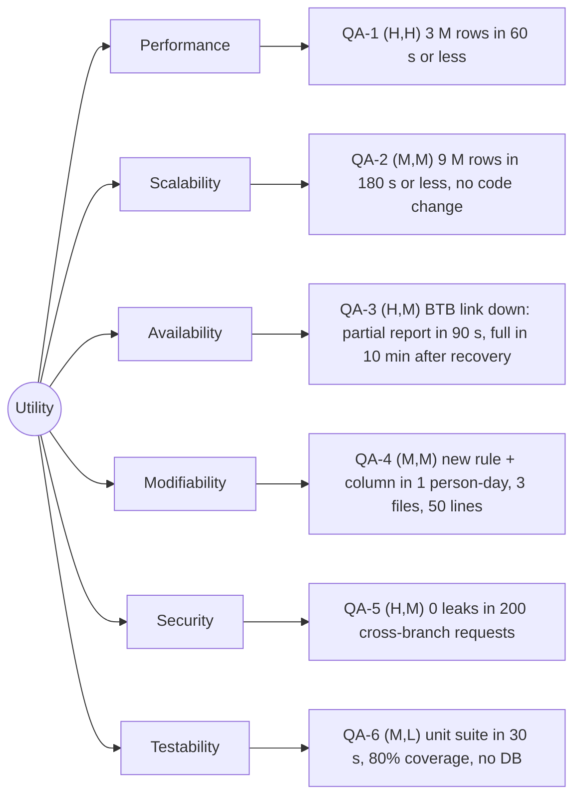

# Quality-attribute scenarios: Angkor Mart monthly sales report

## Stakeholders
- Head-office analyst: reads the report each month, needs correct totals and the files ready first thing in the morning.
- Branch manager (PNH, REP, BTB): reads the figures of their own branch only and must never see another branch's data.
- Finance director: owns the numbers, wants accurate totals, an audit trail, and quick changes when tax or reporting rules change.
- Operations person who runs the job: monitors the 06:00 scheduled run, handles failures and re-runs, needs clear status and alerts.
- Our team (developers): must change, test and extend the code safely during the semester.

## Scenarios
| ID | Attribute | Source | Stimulus | Artifact | Environment | Response | Response measure | Rank |
|----|-----------|--------|----------|----------|-------------|----------|------------------|------|
| QA-1 | Performance | Scheduler, 06:00 on day 2 of M+1 | Starts the report for a month of about 3 M rows | Report engine | Normal operation, 8-core server, files complete | Report files written, "ready" event published | <= 60 s wall-clock, median of 5 runs after 2 warm-up runs | (H,H) |
| QA-2 | Scalability | Finance director (business growth) | Monthly volume grows to 9 M rows (3x) and branches grow from 3 to 10 | Report engine and storage layer | Normal operation, same 8-core server, files complete | Report still completes with no code change (configuration only) | <= 180 s wall-clock (<= 3.0x the QA-1 time) at 9 M rows, median of 5 runs after 2 warm-ups; peak heap <= 2 GB | (M,M) |
| QA-3 | Availability | Network (BTB branch link failure) | BTB link drops at 05:30 and its data file is not received by 06:00 | Data collection and report engine | Normal operation, nightly run, other 2 branches' files complete | Report is generated for the branches that arrived, BTB is flagged "data missing", system retries and regenerates when BTB data arrives | Partial report published <= 90 s after 06:00 in 100% of 10 fault-injection runs; retry every 5 min; full report regenerated <= 10 min after link recovery; 0 crashes | (H,M) |
| QA-4 | Modifiability | Finance director | Asks for a new rule: change the VAT rate and add one new column (e.g. discount total) to the branch report | Calculation and report-format modules | Development, code base at the end of the semester | Change is made, tested and deployed without touching unrelated modules | <= 1 person-day of effort, <= 3 files changed, <= 50 lines changed (from `git diff --stat`), 0 changes outside calc/format modules | (M,M) |
| QA-5 | Security | Authenticated branch manager of REP | Requests PNH's report by changing the branch id in the request | Report access interface and stored report files | Normal operation, 3 branch accounts, reports published | Request denied (HTTP 403), nothing from PNH is returned, event written to the audit log | 0 leaks in 200 cross-branch test requests (100% denied); audit entry written <= 1 s after each denial; own-branch request served in <= 2 s | (H,M) |
| QA-6 | Testability | Developer on our team | Runs the automated tests after changing the calculation code | Calculation module | Development laptop, no database, no network, 10 k-row fixture | Totals are compared with a golden file; failures name the branch and field | Whole unit suite <= 30 s; >= 80% line coverage of the calculation module; 0 external dependencies needed | (M,L) |

## Rank justifications
- QA-1 (H,H): the report is due in the morning; 3 M rows with BigDecimal arithmetic must be read, aggregated and written within the window, and meeting 60 s shapes the whole data-processing design (parallelism, streaming, memory).
- QA-2 (M,M): growth is likely but not immediate, so it matters less than today's deadline, and it is mostly solved if QA-1 is solved with a design that parallelises and streams.
- QA-3 (H,M): the finance director cannot wait for a missing branch, and a partial-plus-retry design is a well-known pattern, but it affects ingestion, status tracking and the "ready" event.
- QA-4 (M,M): rules and columns will change several times, but the cost is acceptable if calculation and formatting are separated, which is a normal modular split.
- QA-5 (H,M): leaking one branch's figures to another is a serious business and trust failure, and it must be enforced at the access layer and the file storage, not only in the UI.
- QA-6 (M,L): it matters for the team's confidence, but it is cheap to get right once calculations are pure functions with no I/O.

## Assumptions
- A1: the report server has 8 cores and an SSD (to confirm with the client).
- A2: "about 3 M rows" is one month of sales lines in total across the 3 branches; the file is complete by 06:00 on day 2.
- A3: growth target is 3x volume and 10 branches within two years (to confirm with the finance director).
- A4: each branch sends its data as one file per night; BTB is the branch with the least reliable link.
- A5: "ready" event means a message published after all report files are written to disk.
- A6: the heap limit of 2 GB is a team decision for the shared server.
- A7: VAT rate and new columns are the typical changes; the VAT rate is a business rule and not hard-coded in several places.
- A8: three branch accounts exist (PNH, REP, BTB) and a head-office account that can see all branches.
- A9: warm-up runs are needed because of JVM start-up and JIT compilation.

## Utility tree

## Architectural drivers
QA-1 (H,H), QA-3 (H,M), QA-5 (H,M)